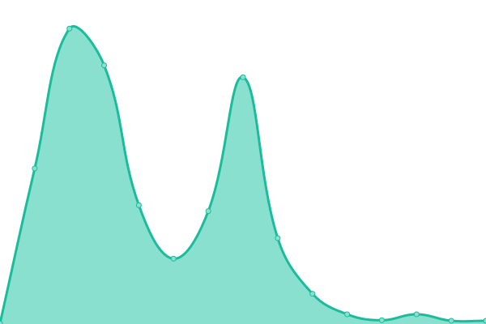

# [📈 Live Status](https://speedrapide10.github.io/upptime): <!--live status--> **🟧 Partial outage**

This repository contains the open-source uptime monitor and status page for [KAREM Oussama](https://speedrapide10.github.io/), powered by [Upptime](https://github.com/upptime/upptime).

With [Upptime](https://upptime.js.org), you can get your own unlimited and free uptime monitor and status page, powered entirely by a GitHub repository. We use [Issues](https://github.com/speedrapide10/upptime/issues) as incident reports, [Actions](https://github.com/speedrapide10/upptime/actions) as uptime monitors, and [Pages](https://speedrapide10.github.io/upptime) for the status page.

<!--start: status pages-->
<!-- This summary is generated by Upptime (https://github.com/upptime/upptime) -->
<!-- Do not edit this manually, your changes will be overwritten -->
<!-- prettier-ignore -->
| URL | Status | History | Response Time | Uptime |
| --- | ------ | ------- | ------------- | ------ |
|  [Portfolio](https://speedrapide10.github.io) | 🟩 Up | [portfolio.yml](https://github.com/speedrapide10/upptime/commits/HEAD/history/portfolio.yml) | 

 87ms
     
 | 

<a href="https://speedrapide10.github.io/upptime/history/portfolio">100.00%</a>
    

|  [Proxmox](https://pve.speednight.tk) | 🟥 Down | [proxmox.yml](https://github.com/speedrapide10/upptime/commits/HEAD/history/proxmox.yml) | 

 146ms
     
 | 

<a href="https://speedrapide10.github.io/upptime/history/proxmox">0.25%</a>
    

|  [Portainer](portainer.speednight.tk) | 🟥 Down | [portainer.yml](https://github.com/speedrapide10/upptime/commits/HEAD/history/portainer.yml) | 

 314ms
     
 | 

<a href="https://speedrapide10.github.io/upptime/history/portainer">0.14%</a>
    

|  [Portainer-test](portainer.speednight.tk) | 🟩 Up | [portainer-test.yml](https://github.com/speedrapide10/upptime/commits/HEAD/history/portainer-test.yml) | 

 3ms
     
 | 

<a href="https://speedrapide10.github.io/upptime/history/portainer-test">100.00%</a>
    

<!--end: status pages-->

[**Visit our status website →**](https://speedrapide10.github.io/upptime)

## 📄 License

- Powered by: [Upptime](https://github.com/upptime/upptime)
- Code: [MIT](./LICENSE) © [KAREM Oussama](https://speedrapide10.github.io/)
- Data in the `./history` directory: [Open Database License](https://opendatacommons.org/licenses/odbl/1-0/)
